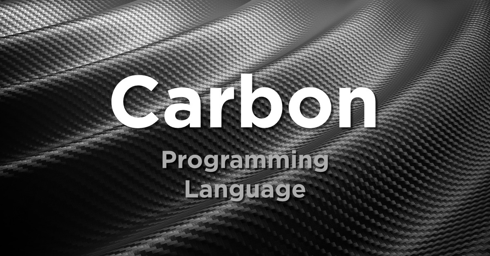

# Carbon programming language


#### The successor to C++

Google has recently announced a new programming language called Carbon that took the attention due to the title "A powerful successor of C++". Most of the programmers have even a small experience with programming languages such as go, rust, kotlin, or typescript and you must have felt the significant boundaries and limitations with low-level operations, performance issues, and also migration from C++. The technical debt of C++ difficulties of its evolution process prevents us to inherit the legacy of C and C++. That is why Google made an initiation to start with a new language from scratch and based on a modern generic system to address these problems with simpler syntax and a modular code organization. For now, Carbon programming language is in the experiment stage, It is open-source and can be downloaded from the official GitHub repository.

As we said Carbon is a successor of C++ fundamentally and it has been designed around interoperability with C++ and as a large-scale migration from the existing C++ codebase. Based on this definition such a language should address the following issues fundamentally

- matching performance
- Bidirectional interoperability with C++
- an easy and clear learning curve for C+= developers
- Support for existing software design and architectures
- Scalable migration with a source-to-source translation for C++ code

If such a language can meet the essentials above then we can migrate the existing C++ developers community, investments, and codebases. Following programming languages respected the aforementioned essentials and have the same design model.

- Java → Kotlin
- javascript → Typescript
- C++ → Carbon

Carbon helloworld

```
package main;

fun main()->32{
    Print("Hello Carbon");
}
```

### Carbon and C++ example

```cpp
#include <iostream>
#include <vector>
#include<algorithm>

void DoubleElement(int number){
    number=number * 2;
    std::cout<<number;
}

int main(){
    std::vector<int> numbers;
    numbers.push_back(15);
    numbers.push_back(16);
    for_each(numbers.begin(), numbers.end(), DoubleElement);
    
return 0;
}
```

```
// Carbon
package main;
import Console;

fn doubleElement(number: i32){
    number+=number;
    Console.Print(number);
}

fn Main() -> i32{
    var numbers:[i32;];
    numbers[0]=15;
    numbers[1]=16;
    for (var number: i32 in numbers){
    doubleElement(number);
    }

}
```

### Try carbon with Carbon explorer

```bash
# Install bazelisk using Homebrew.
$ brew install bazelisk

# Install Clang/LLVM using Homebrew.
# Many Clang/LLVM releases aren't built with options we rely on.
$ brew install llvm
$ export PATH="$(brew --prefix llvm)/bin:${PATH}"

# Download Carbon's code.
$ git clone https://github.com/carbon-language/carbon-lang
$ cd carbon-lang

# Build and run the explorer.
$ bazel run //explorer -- ./explorer/testdata/print/format_only.carbon
```

### Noticable Carbon features

- Introducer keywords and a simple grammar
- Function input parameters are readonly values
- Pointers provide indirect access & mutation
- Use expressions to name types
- The package is the root namespace
- Import APIs through their package name
- Explicit object parameter declares a method
- Single inheritance; classes are final by default
- Powerful, definition-checked generics
- Types explicitly implement interfaces

Although based on the definition and the approach of Carbon it seems to be a very powerful and Performance-critical language and a successor of C++, it is in the first stage and needs more contribution and work. [Here]([carbon-lang/CONTRIBUTING.md at trunk · carbon-language/carbon-lang · GitHub](https://github.com/carbon-language/carbon-lang/blob/trunk/CONTRIBUTING.md)) you can find out how you can contribute.