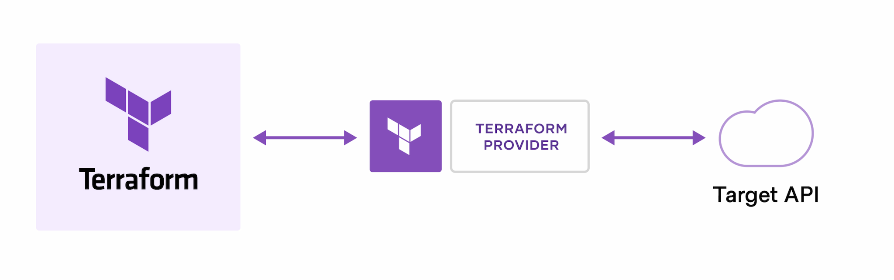
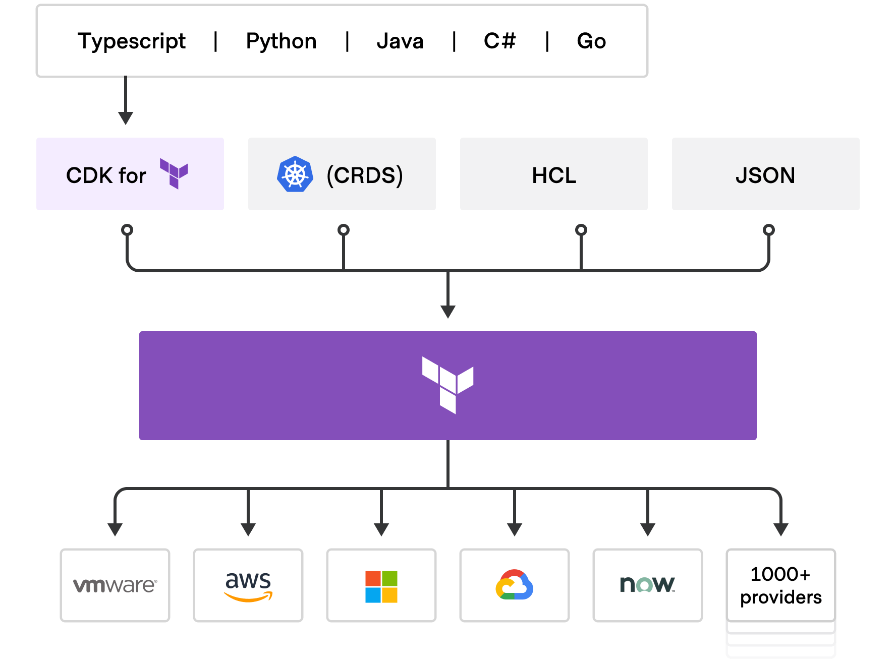

# Infrastructure as code

We all may face common problems while provisioning a cloud infrastructure. Regardless the type of the infrastructure and the provider of these infrastructures there are common hardships in this way. One of the difficaulties is to automate and monitor the whole infrastructure as we need to do thousands of configurations, plugin and module installations, ... etc. We had to look for a way to somehow codify this process with the programming languages that we are familiar with already. Infrastracture as code also known as IaC is an IT Ops practice that codifies the underlying IT infrastructure as a software. With the infrastructure as code we are able as developers or operators automatically provision, manage, and monitor the underlying resources of a service or software.

The concept of infrastructure as code is similar to programming [scripts](https://www.techtarget.com/whatis/definition/script), which are used to automate IT processes. However, scripts are primarily used to automate a series of static steps that are repeated numerous times across multiple servers. Infrastructure as code uses higher-level or descriptive language to code more versatile and adaptive provisioning and deployment processes. For example, infrastructure-as-code capabilities included with Ansible, an IT management and configuration tool, can install [MySQL](https://www.techtarget.com/searchoracle/definition/MySQL) server, verify that MySQL is running properly, create a user account and password, set up a new database and remove unneeded databases.

The code-based infrastructure automation process closely resembles software design practices in which development teams carefully control code versions, test iterations and limit deployment until the software is proven and approved for production.

There are many benefits associated with infrastructure as code, from efficiencies of automation to its flexibility to align with other modern IT practices.

- **Speed and efficiency.** Automated provisioning and management are faster and more efficient than manual processes. This stretches not just to provisioned resources and virtualization, but also to databases, networking, user account management and other tied-in services. IaC also can include code that automatically scales (adds or shuts down environments and resources when they are no longer needed).
- **Consistency.** Software developers can use code to provision and deploy servers and applications according to business practices and policies, rather than rely on system administrators in a [DevOps](https://www.techtarget.com/searchitoperations/definition/DevOps) environment. A developer might create a configuration file to provision and deploy a new application for [quality assurance](https://www.techtarget.com/searchsoftwarequality/definition/quality-assurance) or experimental deployment before operations takes over for live deployment in production.
- **Alignment with DevOps.** With the infrastructure setup written as code, it can go through the same version control, automated testing and other steps of a [continuous integration](https://www.techtarget.com/searchsoftwarequality/definition/continuous-integration) and [continuous delivery](https://www.techtarget.com/searchitoperations/definition/continuous-delivery-CD) (CI/CD) pipeline that developers use for application code. An organization may choose to combine infrastructure as code with [containers](https://www.techtarget.com/searchitoperations/definition/container-containerization-or-container-based-virtualization), which abstract the application from the infrastructure at the operating system level. Because the OS and hardware infrastructure are provisioned automatically and the application is [encapsulated](https://www.techtarget.com/searchnetworking/definition/encapsulation) atop it, these technologies prove complementary for diverse deployment targets, such as test, staging and production.

Despite its benefits, infrastructure as code poses potential disadvantages. It requires additional tools, such as a [configuration management](https://www.techtarget.com/searchitoperations/definition/configuration-management-CM) and automation/orchestration system, that could introduce learning curves and room for error. Any errors can proliferate quickly through servers, especially where there is extensive automation, so it is essential to monitor version control and perform comprehensive prerelease testing.

# Terraform as a well-known IaC

Hashicorp Terraform as an infrastructure as code (IaC) enables us to define both cloud and non-perm resources in a declarative language that you can version, maintain,resuse and share. With terraform we can have a consistent workflow to provision and manage the whole infrastructure thoughout its lifecycle. Terraform can manage following resources:

- low-level components
  
- storage
  
- networking
  
- high-level components like DNS entries and SaaS features
  

Terraform creates and manages resources on a cloud infrastructure and other services though their application programming interface(APIs). Providers enable Terraform to work with virtually any platform or service with an accessible API.


Below you can take a look at a terraform plan example

```bash
# From https://github.com/devopshobbies/terraform-vsphere-ansible/blob/main/part01-terraform-ansible-jenkins/main.tf
# main.tf
terraform {
  required_providers {
    vsphere = {
      source  = "hashicorp/vsphere"
      version = "2.1.1"
    }
  }
}

#===============================================================================
# vSphere Provider
#===============================================================================

provider "vsphere" {
  vsphere_server       = var.vsphere_vcenter
  user                 = var.vsphere_user
  password             = var.vsphere_password
  allow_unverified_ssl = var.vsphere_unverified_ssl
}

#===============================================================================
# vSphere Data
#===============================================================================

data "vsphere_datacenter" "dc" {
  name = var.vsphere_datacenter
}

data "vsphere_compute_cluster" "cluster" {
  name          = var.vsphere_cluster
  datacenter_id = data.vsphere_datacenter.dc.id
}

data "vsphere_datastore" "datastore" {
  name          = var.vm_datastore
  datacenter_id = data.vsphere_datacenter.dc.id
}

data "vsphere_network" "network" {
  name          = var.vm_network
  datacenter_id = data.vsphere_datacenter.dc.id
}

data "vsphere_virtual_machine" "template" {
  name          = var.vm_template
  datacenter_id = data.vsphere_datacenter.dc.id
}

#===============================================================================
# vSphere Resources
#===============================================================================

resource "vsphere_virtual_machine" "standalone" {
  name             = var.vm_name
  resource_pool_id = data.vsphere_compute_cluster.cluster.resource_pool_id
  datastore_id     = data.vsphere_datastore.datastore.id

  num_cpus = var.vm_cpu
  memory   = var.vm_ram
  guest_id = data.vsphere_virtual_machine.template.guest_id

  network_interface {
    network_id   = data.vsphere_network.network.id
    adapter_type = data.vsphere_virtual_machine.template.network_interface_types[0]
  }

  disk {
    label            = "${var.vm_name}.vmdk"
    size             = data.vsphere_virtual_machine.template.disks.0.size
    eagerly_scrub    = data.vsphere_virtual_machine.template.disks.0.eagerly_scrub
    thin_provisioned = data.vsphere_virtual_machine.template.disks.0.thin_provisioned
  }

  clone {
    template_uuid = data.vsphere_virtual_machine.template.id
    linked_clone  = var.vm_linked_clone

    customize {
      timeout = "20"

      linux_options {
        host_name = var.vm_name
        domain    = var.vm_domain
      }

      network_interface {
        ipv4_address = var.vm_ip
        ipv4_netmask = var.vm_netmask
      }

      ipv4_gateway    = var.vm_gateway
      dns_server_list = ["${var.vm_dns}"]
    }
  }
}

# In this section we are going to deal with Ansible in the VM we created before.
resource "local_file" "vm_ip" {
  content  = vsphere_virtual_machine.standalone.default_ip_address
  filename = "vm_ip.txt"
}

resource "null_resource" "nullremote1" {
  depends_on = [vsphere_virtual_machine.standalone]
  connection {
    type     = "ssh"
    user     = "root"
    password = var.password
    host     = var.host
  }
}
provisioner "file" {
  source      = "vm_ip.txt"
  destination = "hosts.txt"
}

# Run command on the remote vm
provisioner "local-exec" {
  inline = [
    "ansible-playbook jenkins.yml"
  ]
}
output "my_ip_address" {
  value = vsphere_virtual_machine.standalone.default_ip_address
}
```

```bash
# variables.tf
#====================#
# vCenter connection #
#====================#

variable "vsphere_user" {
  description = "vSphere user name"
}

variable "vsphere_password" {
  description = "vSphere password"
}

variable "vsphere_vcenter" {
  description = "vCenter server FQDN or IP"
}

variable "vsphere_unverified_ssl" {
  description = "Is the vCenter using a self signed certificate (true/false)"
}

variable "vsphere_datacenter" {
  description = "vSphere datacenter"
}

variable "vsphere_cluster" {
  description = "vSphere cluster"
  default     = ""
}

#=========================#
# vSphere virtual machine #
#=========================#

variable "vm_datastore" {
  description = "Datastore used for the vSphere virtual machines"
}

variable "vm_network" {
  description = "Network used for the vSphere virtual machines"
}

variable "vm_template" {
  description = "Template used to create the vSphere virtual machines"
}

variable "vm_linked_clone" {
  description = "Use linked clone to create the vSphere virtual machine from the template (true/false). If you would like to use the linked clone feature, your template need to have one and only one snapshot"
  default     = "false"
}

variable "vm_ip" {
  description = "Ip used for the vSpgere virtual machine"
}

variable "vm_netmask" {
  description = "Netmask used for the vSphere virtual machine (example: 24)"
}

variable "vm_gateway" {
  description = "Gateway for the vSphere virtual machine"
}

variable "vm_dns" {
  description = "DNS for the vSphere virtual machine"
}

variable "vm_domain" {
  description = "Domain for the vSphere virtual machine"
}

variable "vm_cpu" {
  description = "Number of vCPU for the vSphere virtual machines"
}

variable "vm_ram" {
  description = "Amount of RAM for the vSphere virtual machines (example: 2048)"
}

variable "vm_name" {
  description = "The name of the vSphere virtual machines and the hostname of the machine"
}
```

As you can see we can provission all the resources from Vm and security groupd to networking and DNS configuration and storage devices that an infrastrucure needs with a decalarative language.

After applying the terraform plan terraform will generate a `state file` which contains the current situation of the infrastructure always and during the next apply terraform will lock this file to prevent any conflict on the infrastructe due to concurrency inssues.

# CDK (Cloud Development Kit)

As a foundamental component of modern DevOps practices we introduced Infrastructure as code that helps us to deploy any version of the infrastructure at will, and facilitates the fully automated lifecycle management of all the resources needed to run and monitor the applications. Organizations and companies that are adopted to DevOps practices often deploy houndreds of changes to the production environment daily.

With CDK you don't need to learn a new language (Even delarative) like terraform language to apply IaC on your infrastructure and instead you can use the programming language that you are familiar with already and use the CDk that is provided by the provider of the cloud system and codify all of your infrastructure resources.

# CDKTF



Terraform as a well-known IaC system provides CDK (CDKTF)for several programming languages such as  `typescript`,`golang`, `Python`,`Java`,`C#`. We will go through typescript CDKTF in this article.

To do so at first we need to install CDKTF cli and initialize a typescript project with CDKTF

```bash
npm install --global cdktf-cli@latest
```

to verify the installation you can run the following instruction

```bash
cdktf --version
```

then you should see the lates version on the cdktf.

```bash
mkdir cdktf-project
cd cdktf-project
```

`cdktf-project` directory execute `cdktf init` and choose the template that matches your programming language. For this tutorial we will choose `typescript`

```bash
cdktf init --template="typescript"
Project Name cdktf-project
Project Description cdktf tutorial project

Detected Terraform Cloud token.
We will now set up Terraform Cloud for your project.
Terraform Cloud Organization Name <YOUR_ORG>

We are going to create a new Terraform Cloud Workspace for your project.

Terraform Cloud Workspace Name cdktf-project
Setting up remote state backend and workspace in Terraform Cloud.
Generating Terraform Cloud configuration for '<YOUR_ORG>' organization and 'learn-cdktf' workspace.....
## ...

========================================================================================================

  Your cdktf typescript project is ready!

## ...

 Use Prebuilt Providers:

  You can find all prebuilt providers on npm: https://www.npmjs.com/search?q=keywords:cdktf
  You can install these providers through npm:

  npm install @cdktf/provider-aws
  npm install @cdktf/provider-google
  npm install @cdktf/provider-azurerm
  npm install @cdktf/provider-docker
  npm install @cdktf/provider-github
  npm install @cdktf/provider-null

  You can also build any module or provider locally. Learn more https://cdk.tf/modules-and-providers

========================================================================================================
```

this code will initialize a CDk for Terraform project using an interactive command.

Select your terraform cloud organization and choose the name for the terraform cloud workspace.

try to install AWS provider with the following code

```bash
npm install @cdktf/provider-aws
```

# Define CDK for your terraform application

Open the `main.ts` file to see your application code. The template creates a scaffold with no functionality.

Replace the contents of `main.ts` with the following code for a new TypeScript application, which uses the CDK to provision an AWS EC2 instance in `us-west-1`, and stores its state in Terraform Cloud.

```typescript
import { Construct } from "constructs";
import { App, TerraformStack, TerraformOutput, RemoteBackend } from "cdktf";
import { AwsProvider, ec2 } from "@cdktf/provider-aws";

class MyStack extends TerraformStack {
  constructor(scope: Construct, id: string) {
    super(scope, id);

    new AwsProvider(this, "AWS", {
      region: "us-west-1",
    });

    const instance = new ec2.Instance(this, "compute", {
      ami: "ami-01456a894f71116f2",
      instanceType: "t2.micro",
    });

    new TerraformOutput(this, "public_ip", {
      value: instance.publicIp,
    });
  }
}
const app = new App();
const stack = new MyStack(app, "aws_instance");

new RemoteBackend(stack, {
  hostname: "app.terraform.io",
  organization: "<YOUR_ORG>",
  workspaces: {
    name: "learn-cdktf",
  },
});

app.synth();
```

Replace `<YOUR_ORG>` with the Terraform Cloud organization name you chose when you ran `terraform init` earier.

run your code

```bash
cdktf deploy
```

The `cdktf deploy` command runs `terraform apply` in the background.

Please let me know your comments :)