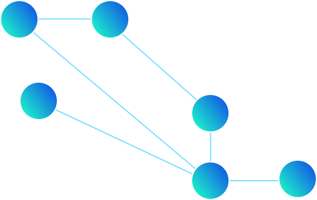
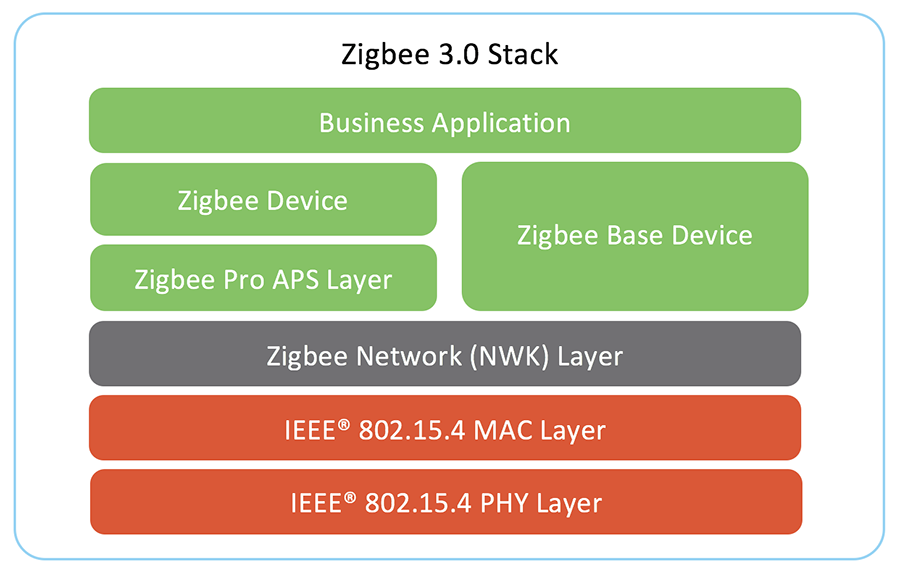

# Zigbee and its application in IoT

Zigbee as a low-power wireless local area network (WLAN) is designed to provide small amount of data using little power with lots of connected devices running of a battery. Due to this property of Zigbee, the open standard has been linked with machine-to-machine (M2M) communication and the industrial internet of things (IoT).

Zigbee unlike Wi-Fi uses a mesh network where devices are tightly connected with many interconnections between other network nodes. Data is sent through mid-range distances of 10 to 100 meters, but ZigBee uses its mesh network specification to significantly extend this distance.



**Zigbee** is defined based on the Electrical and Electronics Engineers Standards Association’s (IEEE) 802.15 specification. 802.15 specification. It operates in unlicensed [radio frequency](http://searchnetworking.techtarget.com/definition/radio-frequency) bands including 2.4 [GHz](http://searchnetworking.techtarget.com/definition/gigahertz), 900 [MHz](http://searchnetworking.techtarget.com/definition/megahertz) and 868 MHz. Use cases for 802.15.4 are aimed at monitoring applications where relatively low levels of data throughput are needed, and with the possibility of remote, battery-powered sensors where low power consumption is required. Sensors, actuators, lighting controls, security, and other home and in-building applications are all possible use cases for the technology.

In general Zigbee protocol features include the following items:

- It has low latency
  
- It provides long battery life due to its low-duty cycle
  
- It supports multiple network topologies such as point-to-point, point-to multiple and mesh networks
  
- it can support up to 65,000 nodes per network mesh
  
- Provides 128-bit encryption for secure data transmission
  
- It has collision avoidance, retries and acknowledgments
  
- Direct Sequence Spread Spectrum (DSSS)
  

Zigbee 3.0 protocol is designed to make data communication through RF environments that are common in commercial and industrial market applications. Version 3.0 builds on the existing Zigbee connectivity standard but unifies the market-specific application profiles to allow all devices to be wirelessly connected in the same network, irrespective of their market designation and function. Furthermore, a Zigbee 3.0 certification scheme ensures the interoperability of products from different device manufacturers.

Zigbee protocol features include:

- Support for multiple network topologies such as point-to-point,  
  point-to-multipoint and mesh networks
- Low duty cycle – provides long battery life
- Low latency
- Direct Sequence Spread Spectrum (DSSS)
- Up to 65,000 nodes per network
- 128-bit AES encryption for secure data connections
- Collision avoidance, retries and acknowledgments



# Zigbee Protocol Compatibility

The backward compatibility of Zigbee 3.0 means that the applications and the smart home devices are developed under the Zigbee light Link 1.0 Home Automation 1.2 profile. The Zigbee Smart Energy profile is also compatible with Zigbee 3.0 at the functional level, but Smart Energy has additional security requirements that are only addressed within the profile.

# ZigBee to MQTT conversion

Most probably you face a situation when you need to somehow convert a Zigbee signal to your message pattern style (With a specific type of message broker). As an example in our current smart-home project, we had to convert the incoming and outgoing ZigBee signals to MQTT messages and send them to our services through an MQTT broker.

To do that we need to initialize an MQTT-Server to operate.

```bash
docker run \
   --name zigbee2mqtt \
   --restart=unless-stopped \
   --device=/dev/ttyACM0 \
   -p 8080:8080 \
   -v $(pwd)/data:/app/data \
   -v /run/udev:/run/udev:ro \
   -e TZ=Europe/Amsterdam \
   koenkk/zigbee2mqtt
```

You can see an MQTT setting example

```bash
# Required: MQTT settings
mqtt:
  # Required: MQTT server URL (use mqtts:// for SSL/TLS connection)
  server: 'mqtt://localhost:1883'
  # Optional: MQTT base topic for Zigbee2MQTT MQTT messages (default: zigbee2mqtt)
  base_topic: zigbee2mqtt
  # Optional: absolute path to SSL/TLS certificate of CA used to sign server and client certificates (default: nothing)
  ca: '/etc/ssl/mqtt-ca.crt'
  # Optional: absolute paths to SSL/TLS key and certificate for client-authentication (default: nothing)
  key: '/etc/ssl/mqtt-client.key'
  cert: '/etc/ssl/mqtt-client.crt'
  # Optional: MQTT server authentication user (default: nothing)
  user: my_user
  # Optional: MQTT server authentication password (default: nothing)
  password: my_password
  # Optional: MQTT client ID (default: nothing)
  client_id: 'MY_CLIENT_ID'
  # Optional: disable self-signed SSL certificates (default: true)
  reject_unauthorized: true
  # Optional: Include device information to mqtt messages (default: false)
  include_device_information: true
  # Optional: MQTT keepalive in seconds (default: 60)
  keepalive: 60
  # Optional: MQTT protocol version (default: 4), set this to 5 if you
  # use the 'retention' device specific configuration
  version: 4
  # Optional: Disable retain for all send messages. ONLY enable if you MQTT broker doesn't
  # support retained message (e.g. AWS IoT core, Azure IoT Hub, Google Cloud IoT core, IBM Watson IoT Platform).
  # Enabling will break the Home Assistant integration. (default: false)
  force_disable_retain: false
```

### Specifying MQTT server/user/password and network_key in a different file

Inorder to specify the MQTT server/user/password in a different file such as `secret.yaml` you can have something like this

**configuration.yaml**

```bash
# IMPORTANT: Don't forget the quotes!
mqtt:
  server: '!secret server'
  user: '!secret user'
  password: '!secret password'
```

**secret.yaml**

```bash
server: 'mqtt://localhost:1883'
user: mqtt_user
password: mqtt_password
```

## MQTT behavior

```bash
advanced:
  # Optional: state caching, MQTT message payload will contain all attributes, not only changed ones.
  # Has to be true when integrating via Home Assistant (default: true)
  cache_state: true
  # Optional: persist cached state, only used when cache_state: true (default: true)
  cache_state_persistent: true
  # Optional: send cached state on startup, only used when cache_state_persistent: true (default: true)
  cache_state_send_on_startup: true
  # Optional: Add a last_seen attribute to MQTT messages, containing date/time of the last Zigbee message
  # possible values are: disable (default), ISO_8601, ISO_8601_local, epoch (default: disable)
  last_seen: 'disable'
  # Optional: Add an elapsed attribute to MQTT messages, containing milliseconds since the previous msg (default: false)
  elapsed: false
  # Optional: Enables report feature, this feature is DEPRECATED since reporting is now setup by default
  # when binding devices. Docs can still be found here: https://github.com/Koenkk/zigbee2mqtt.io/blob/master/docs/information/report.md
  report: true
  # Optional: disables the legacy API (default: shown below)
  legacy_api: true
  # Optional: MQTT output type: JSON, attribute or attribute_and_json (default: shown below)
  # Examples when 'state' of a device is published
  # json: topic: 'zigbee2mqtt/my_bulb' payload '{"state": "ON"}'
  # attribute: topic 'zigbee2mqtt/my_bulb/state' payload 'ON"
  # attribute_and_json: both json and attribute (see above)
  output: 'json'
```

Please leave your lovely comments :)