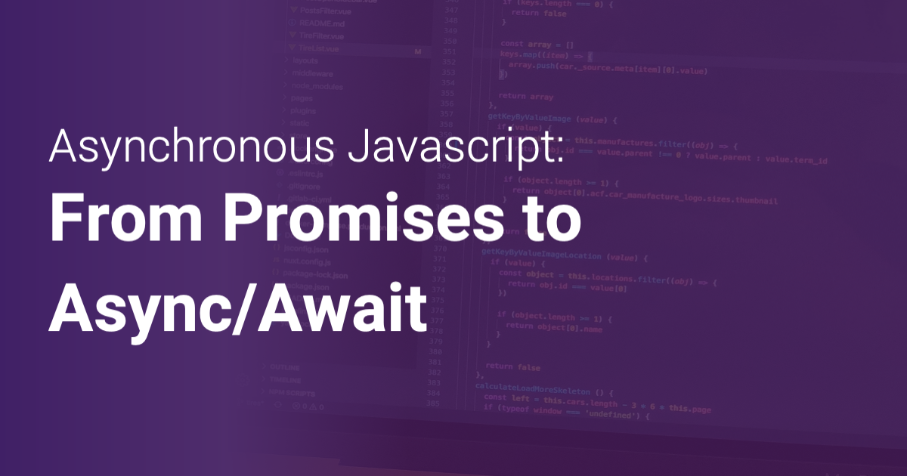
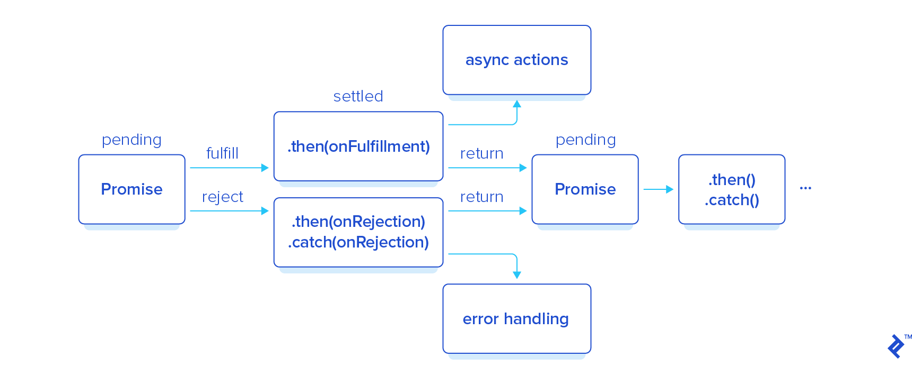
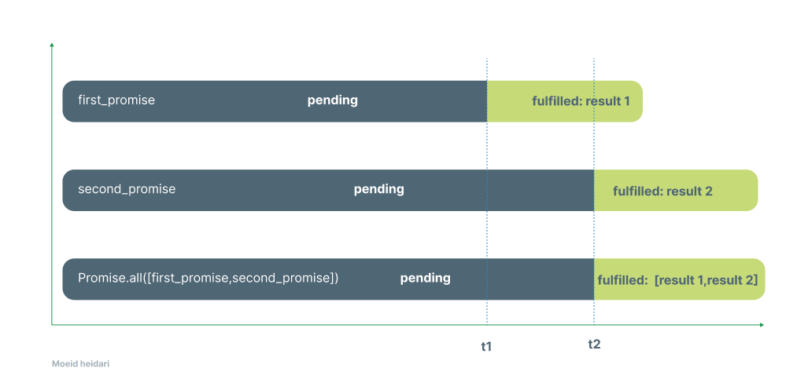
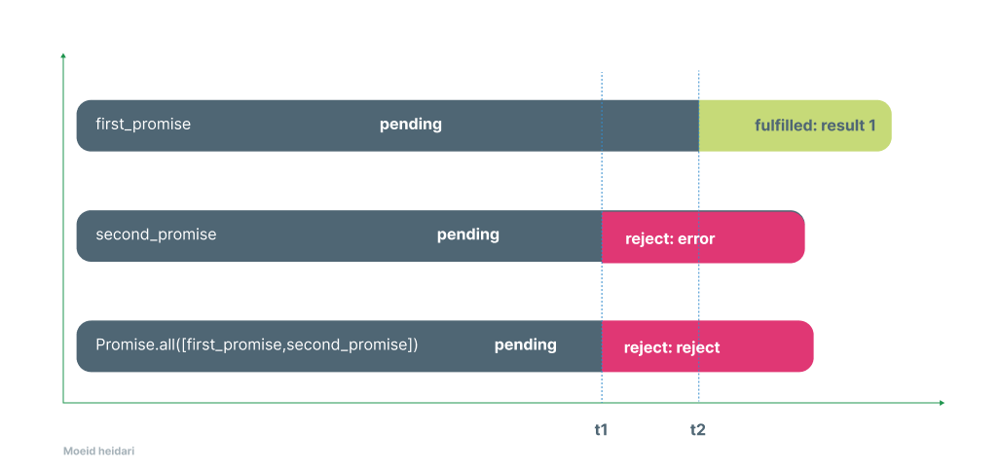

# Overview

In this tutorial, we want to go through a very useful static method of Promises and to aggregate the result from several asynchronous operations.

# Introduction

Asynchronous programming is a technique which enables us to write a program that potentially starts a task and while having this task running it is still able to response to other events, rather than wait for the task to finish.

Following code shows an example of the difference between traditional and asynchronous programming in JavaScript

```js
// traditional approach
const verifyUser = function(username, password, callback){
   dataBase.verifyUser(username, password, (error, userInfo) => {
       if (error) {
           callback(error)
       }else{
           dataBase.getRoles(username, (error, roles) => {
               if (error){
                   callback(error)
               }else {
                   dataBase.logAccess(username, (error) => {
                       if (error){
                           callback(error);
                       }else{
                           callback(null, userInfo, roles);
                       }
                   })
               }
           })
       }
   })
};
```

In this example, each function gets an argument that is another function called with a parameter as the response of the previous action. It may happen to have hundreds of such functions inside your code if you are not familiar with `asynchronous` programming technique.

As you can see from the example above, this function would get more complex and hard to debug once you realize that a `database.getRoles` is another function that may have nested callbacks.

```js
const getRoles = function (username, callback){
   database.connect((connection) => {
       connection.query('get roles sql', (result) => {
           callback(null, result);
       })
   });
};
```

Additionally it is much more difficult to maintain such a code where `DRY` principle may have no value in this case.

# Javascript Promises

> **Definition**
> a promise is an **object** that encapsulates the result of an **asynchronous operation**.

A promise object has a state that can be one of the following:

- Pending
- Fulfilled with a **value**
- Rejected for a **reason**



To overcome such problems JavaScript has provided an approach called `promises` and with having these promises in place, our example would look like this

```js
const verifyUser = function(username, password) {
   database.verifyUser(username, password)
       .then(userInfo => dataBase.getRoles(userInfo))
       .then(rolesInfo => dataBase.logAccess(rolesInfo))
       .then(finalResult => {
           //write the functionality once the callback is called
       })
       .catch((err) => {
           //write whatever the error handler needs
       });
};
const getRoles = function (username){
   return new Promise((resolve, reject) => {
       database.connect((connection) => {
           connection.query('get roles sql', (result) => {
               resolve(result);
           })
       });
   });
};
```

As you can see, we have modified our code to return a promise with several callbacks and some actions are performed promise itself. `resolve` and `reject` callbacks shall to be mapped to `promise.then` and `promise.catch` methods accordingly.

**Note** in above example `getRole` method can internally prone to the `pyramid of doom` phenomenon if the database connection method does not return a Promise itself. Otherwise, our getRole method would look like this

```js
const getRoles = new function (userInfo) {
   return new Promise((resolve, reject) => {
       database.connect()
           .then((connection) => connection.query('get roles sql'))
           .then((result) => resolve(result))
           .catch(reject)
   });
};
```

Even though, the `pyramid of doom` overwhelmingly mitigated by the introduction of Promises, we still have to rely on callbacks that are passed to `.then` and `.catch`.

[ECMAScript 2017]([ECMAScript - Wikipedia](https://en.wikipedia.org/wiki/ECMAScript#8th_Edition_-_ECMAScript_2017)) introduced two useful statements called `async` and `await` that allows us to write **Promisified** code blocks as if it were synchronous. It enables us to have such code style while without blocking the main thread as you can see an example below

```js
const verifyUser = async function(username, password){
   try {
       const userInfo = await dataBase.verifyUser(username, password);
       const rolesInfo = await dataBase.getRoles(userInfo);
       const logStatus = await dataBase.logAccess(userInfo);
       return userInfo;
   }catch (e){
       //handle errors as needed
   }
};
```

**Note** Having `await` is just allowed inside an `async` function. Once you decide to use `await` you can wait for the result of a `promise` without making additional changes in other methods.

# Promise.all

In general `Promise.all` method works on `iterable` of `Promises`.

> **Definition**
> An object is iterable when it contains a method called `[Symbol.iterator]` that takes no argument and returns an object which conforms to the iterator protocol.
> 
> The `[Symbol.iterator]` is one of the built-in well-known [symbols](https://www.javascripttutorial.net/es6/symbol/) in ES6.

`Promise.all` takes an iterable of promises as an array within its argument and returns back a single promise that resolves when all the promises have been resolved`Promise.all(iterable)`.



As you can see from the diagram `first_promise` resolves the `result 1` at `t1` and `second_promise` resolves the `result 2` at `t2` and finally `Promise.all([first_promise,second_promise])` resolves `[result 1,result 2]` at `t2`.

In a case when one of the promises rejects, the `Promise.all` immediately returns a promise that rejects with an error of first rejected promise as you can see from the following diagram.



An example of `Promise.all` in javascript

```js
const p1 = new Promise((resolve, reject) => {
  setTimeout(() => {
    resolve('Promise 1 has resolved');
  }, 1 * 1000);
});
const p2 = new Promise((resolve, reject) => {
  setTimeout(() => {
    resolve('Promise 2 has resolved');
  }, 2 * 1000);
});
const p3 = new Promise((resolve, reject) => {
  setTimeout(() => {
    resolve('Promise 3 has resolved');
  }, 3 * 1000);
});

Promise.all([p1, p2, p3])
```

Output

```bash
Promise 1 has resolved
Promise 2 has resolved
Promise 3 has resolved
```

An example of rejected Promises

```js
const p1 = new Promise((resolve, reject) => {
  setTimeout(() => {
    resolve('Promise 1 has resolved');
  }, 1 * 1000);
});
const p2 = new Promise((resolve, reject) => {
  setTimeout(() => {
    reject('Promise 2 has rejected');
  }, 2 * 1000);
});
const p3 = new Promise((resolve, reject) => {
  setTimeout(() => {
    resolve('Promise 3 has resolved');
  }, 3 * 1000);
});

Promise.all([p1, p2, p3])
            .then(result)
            .then(error=>{console.log(error)})
```

```bash
Promise 1 has resolved
Promise 2 has rejected
Failed
Promise 3 has resolved
```

Please let me know if you have any comment on this article :)